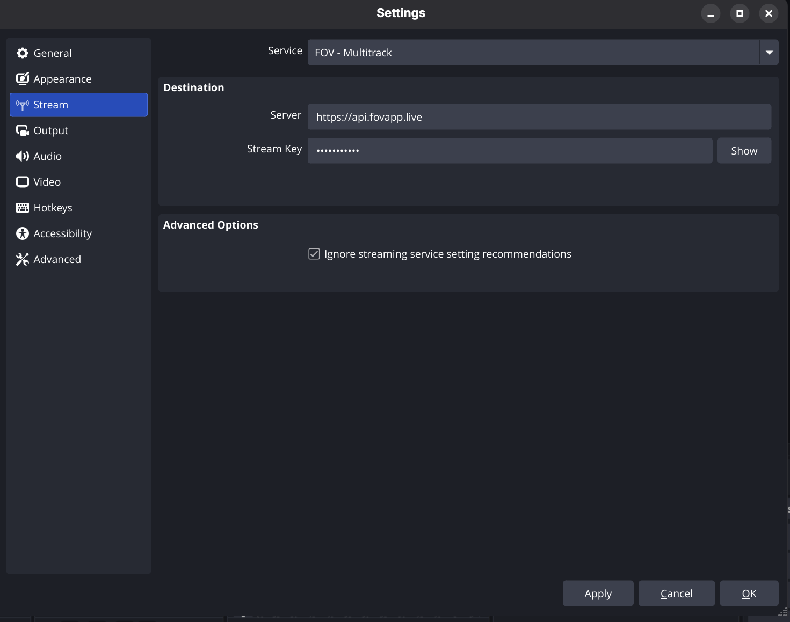
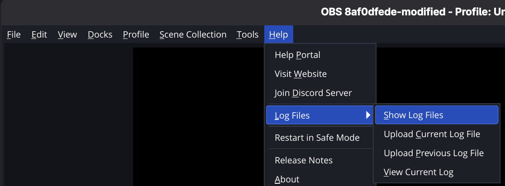

# OBS Studio for FOV
This is the repository for the customized version of OBS to be used with the FOV system.

If you are looking for the official OBS Studio, please go to [this repository](https://github.com/obsproject/obs-studio).

## Installing OBS/FOV
Please download the latest build from the [release page on GitHub](https://github.com/Flexible-Output-View/obs-studio-fov/releases).

## Building OBS/FOV

### Cloning the repository
You must clone the repository using this command to pull all required submodules:

```bash
git clone --recurse-submodules git@github.com:Flexible-Output-View/obs-studio-fov.git
```

If you want to build OBS manually, you can execute one of the following scripts:
- `requirements.sh`: Install all required packages for Ubuntu (run this first).
- `build_install_release_ubuntu.sh`: Create a release build for Linux and install it to your system. All build cache is cleared before building.
- `build_install_ubuntu.sh`: Create a debug build for Linux and install it to your system. All build cache is cleared before building.
- `quick_build_install_ubuntu.sh`: Create a release build and install it quickly.
- `build_portable_ubuntu.sh`: Build OBS without installing it to your system.

## Quick Start
To use OBS/FOV, you must have an instance of [web-fov](https://github.com/Flexible-Output-View/web-fov) deployed, or use a public instance such as [https://fovapp.live](https://fovapp.live).

To stream to an FOV instance, you must select the **FOV - Multitrack** service in the settings, and fill in the following information:
- **URL**: The URL of the API of the instance you wish to connect to (e.g., https://api.fovapp.live).
- **Stream key**: Your stream key (this is WIP; for now you can simply enter your name).

Then simply start the stream by pressing the **Start Streaming** button.



> [!Note]
> - All active video sources currently in the scene will be encoded as independent video tracks.
> - Audio is split across streams based on your OBS Advanced Audio Properties track routing (Mix 1, Mix 2, etc.).
> - You cannot add or delete video sources while streaming.
> - If the stream fails to initialize, please share your log files with us so we can investigate.

> [!Warning]
> - Since all sources are encoded simultaneously when using FOV, we strongly advise using hardware encoders (NVENC, AMF, QuickSync) to minimize performance impact.
> - You must adapt your settings accordingly by keeping a relatively low bitrate per track, since all sources will be encoded with the same configuration.
> - Keep in mind that using FOV will consume substantially more upload bandwidth than a regular single-track stream.

## Contributing
> [!Warning] Important
> - All issues must be opened on the [OBS/FOV repository](https://github.com/Flexible-Output-View/obs-studio-fov).
> - Issues that are not specific to FOV may be discarded.
> - Include as much detail as you can in your report, and post all steps required to trigger the problem.

If you find issues specifically with the OBS/FOV software, you can open a GitHub issue describing the problem you are encountering and we will take a look at it.

To facilitate debugging, we encourage you to provide details about your specific configurations as well as the log file created by OBS (you can show it by clicking the help button in the toolbar).



If you want to suggest improvements, please take a look at this [GitHub discussion](https://github.com/orgs/Flexible-Output-View/discussions/1).

For code contributions, please open a pull request with details about your specific fix or feature. We encourage all contributors to follow the existing [OBS contribution guidelines](./CONTRIBUTING.rst) that apply to this specific repository, with a few custom additions:
- We encourage this commit format: `ADD/UPDATE/DELETE/CHORE/FIX: Message...`
- We cannot use OBS static analysis since it is not available outside the main OBS repository; this means we expect a minimum testing effort on your side.
- Architecture changes, protocol modifications, or anything that requires a change on the web ecosystem of FOV must be discussed first on a GitHub Discussion. Please tag @LucasLoustalot, @RaphxelS, and @Slymoz.
